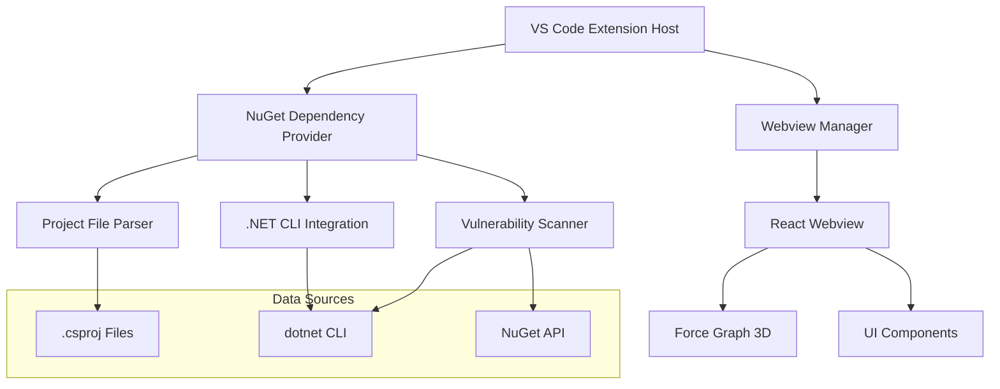

# Design Document

## Overview

The NuGet Package Dependency Visualizer is a Visual Studio Code extension that provides interactive 3D visualization of NuGet package dependencies and vulnerabilities for .NET projects. The extension leverages React and force-graph-3d to create immersive, interactive dependency graphs that help developers understand their project's dependency structure and identify security vulnerabilities.

The extension follows a modular architecture with clear separation between the VS Code extension host, dependency analysis logic, and the React-based webview visualization layer.

## Architecture

### High-Level Architecture



### Component Architecture

The extension is structured into several key layers:

1. **Extension Host Layer**: VS Code integration and command handling
2. **Data Analysis Layer**: NuGet dependency parsing and vulnerability analysis
3. **Presentation Layer**: React-based webview with 3D visualization
4. **Communication Layer**: Message passing between extension and webview

## Components and Interfaces

### 1. Extension Host (`src/extension.ts`)

**Purpose**: Main entry point for the VS Code extension, handles command registration and orchestrates the dependency analysis workflow.

**Key Responsibilities**:

- Register VS Code commands for different visualization modes
- Handle file context detection (.csproj files)
- Coordinate between dependency provider and webview manager
- Provide user feedback and error handling

**Interface**:

```typescript
interface ExtensionCommands {
  visualizeDependencies(uri?: vscode.Uri): Promise<void>;
  visualizeVulnerabilities(uri?: vscode.Uri): Promise<void>;
  visualizeFullGraph(uri?: vscode.Uri): Promise<void>;
}
```

### 2. NuGet Dependency Provider (`src/providers/nugetDependencyProvider.ts`)

**Purpose**: Core business logic for analyzing .NET projects and extracting dependency information.

**Key Responsibilities**:

- Parse .csproj files and extract PackageReference entries
- Execute .NET CLI commands to resolve transitive dependencies
- Scan for vulnerabilities using `dotnet list package --vulnerable`
- Transform raw dependency data into graph-ready format
- Handle different .NET project formats and frameworks

**Interface**:

```typescript
interface INuGetDependencyProvider {
  getDependencies(projectPath: string): Promise<DependencyAnalysisResult>;
  getDependenciesWithVulnerabilities(projectPath: string): Promise<DependencyAnalysisResult>;
  getFullDependencyGraph(projectPath: string): Promise<DependencyAnalysisResult>;
}
```

**Implementation Strategy**:

- **Primary Method**: Use `dotnet list package` commands for accurate dependency resolution
- **Fallback Method**: Direct XML parsing of .csproj files when CLI is unavailable
- **Vulnerability Detection**: Leverage `dotnet list package --vulnerable --format json`
- **Caching**: Implement intelligent caching to avoid redundant CLI calls

### 3. Webview Manager (`src/webview/webviewManager.ts`)

**Purpose**: Manages the lifecycle and communication with the React-based webview panel.

**Key Responsibilities**:

- Create and configure webview panels with appropriate security policies
- Generate HTML content with embedded data for React consumption
- Handle bidirectional communication between extension and webview
- Manage webview lifecycle (creation, disposal, message handling)

**Interface**:

```typescript
interface IWebviewManager {
  showDependencyGraph(data: DependencyAnalysisResult, mode: VisualizationMode): Promise<void>;
}

type VisualizationMode = 'dependencies' | 'vulnerabilities' | 'full';
```

### 4. React Webview Application (`src/webview/`)

**Purpose**: Interactive 3D visualization interface built with React and force-graph-3d.

**Component Hierarchy**:

```
App
├── DependencyGraph (Main 3D visualization)
├── InfoPanel (Project and node information)
├── VulnerabilityLegend (Color coding reference)
└── Controls (Graph interaction controls)
```

**Key Features**:

- **3D Force-Directed Graph**: Uses react-force-graph-3d for interactive visualization
- **Dynamic Node Styling**: Color-coded nodes based on vulnerability severity
- **Interactive Controls**: Zoom, pan, drag, and physics simulation controls
- **Contextual Information**: Detailed package and vulnerability information panels
- **Responsive Design**: Adapts to different screen sizes and VS Code themes

## Data Models

### Core Data Structures

```typescript
// Primary package representation
interface NuGetPackage {
  id: string;                    // Package identifier (e.g., "Newtonsoft.Json")
  version: string;               // Requested version
  resolved?: string;             // Actual resolved version
  dependencies?: NuGetPackage[]; // Direct dependencies
  vulnerabilities?: Vulnerability[]; // Security vulnerabilities
  isTransitive?: boolean;        // Whether this is a transitive dependency
  depth?: number;               // Dependency depth level
}

// Vulnerability information
interface Vulnerability {
  id: string;                   // Vulnerability identifier
  severity: 'Low' | 'Moderate' | 'High' | 'Critical';
  title: string;                // Human-readable title
  description?: string;         // Detailed description
  advisoryUrl?: string;         // Link to security advisory
  cve?: string[];              // CVE identifiers
}

// Graph visualization nodes
interface GraphNode {
  id: string;                   // Unique node identifier
  name: string;                 // Package name
  version: string;              // Package version
  group?: string;               // Node grouping (direct/transitive)
  val?: number;                 // Node size value
  color?: string;               // Node color
  vulnerabilities?: Vulnerability[];
  isRoot?: boolean;             // Is this a root dependency
  depth?: number;               // Dependency depth
}

// Graph visualization links
interface GraphLink {
  source: string;               // Source node ID
  target: string;               // Target node ID
  value?: number;               // Link strength
  color?: string;               // Link color
}
```

### Data Flow

1. **Input**: .csproj file path from VS Code command
2. **Analysis**: NuGet Dependency Provider processes the project
3. **Transformation**: Raw dependency data converted to graph format
4. **Visualization**: React webview renders interactive 3D graph
5. **Interaction**: User interactions trigger updates and information display

## Error Handling

### Comprehensive Error Management Strategy

**1. .NET CLI Availability**

- **Detection**: Check for `dotnet` command availability
- **Fallback**: Use direct project file parsing when CLI unavailable
- **User Guidance**: Provide installation instructions for .NET SDK

**2. Project File Parsing**

- **Validation**: Verify .csproj file format and structure
- **Error Recovery**: Graceful handling of malformed XML
- **User Feedback**: Specific error messages for parsing failures

**3. Vulnerability Data Retrieval**

- **Network Resilience**: Handle offline scenarios gracefully
- **Caching**: Store vulnerability data locally when possible
- **Degraded Mode**: Continue with dependency visualization when vulnerability data unavailable

**4. Webview Communication**

- **Message Validation**: Validate all messages between extension and webview
- **Error Boundaries**: React error boundaries to prevent UI crashes
- **Graceful Degradation**: Fallback UI states for data loading failures

## Testing Strategy

### Unit Testing

- **Dependency Provider**: Mock .NET CLI responses and test parsing logic
- **Data Transformation**: Verify graph data generation from various input scenarios
- **Error Handling**: Test all error conditions and recovery mechanisms

### Integration Testing

- **End-to-End Workflows**: Test complete user scenarios from command to visualization
- **CLI Integration**: Test with various .NET project types and configurations
- **Webview Communication**: Verify message passing and data synchronization

### Manual Testing

- **Cross-Platform**: Test on Windows, macOS, and Linux
- **Project Varieties**: Test with different .NET frameworks and project structures
- **Performance**: Verify performance with large dependency graphs

## Performance Considerations

### Optimization Strategies

**1. Data Processing**

- **Lazy Loading**: Load transitive dependencies on demand
- **Caching**: Cache CLI results to avoid redundant calls
- **Debouncing**: Debounce file system watchers for project changes

**2. Visualization Performance**

- **Node Culling**: Limit visible nodes for very large graphs
- **Level-of-Detail**: Reduce visual complexity for distant nodes
- **Physics Optimization**: Tune force simulation parameters for stability

**3. Memory Management**

- **Webview Lifecycle**: Proper cleanup of webview resources
- **Data Streaming**: Stream large datasets instead of loading all at once
- **Garbage Collection**: Minimize object creation in animation loops

## Security Considerations

### Content Security Policy

- **Strict CSP**: Implement restrictive Content Security Policy for webview
- **Resource Isolation**: Limit webview access to necessary resources only
- **Script Execution**: Control script execution within webview context

### Data Handling

- **Input Validation**: Validate all user inputs and file paths
- **Sanitization**: Sanitize data before displaying in webview
- **Privilege Separation**: Run analysis with minimal required permissions

## Deployment and Distribution

### Extension Packaging

- **Webpack Configuration**: Optimize bundle size for both extension and webview
- **Asset Management**: Include necessary force-graph-3d assets locally
- **Dependency Management**: Bundle required dependencies while minimizing size

### VS Code Marketplace

- **Metadata**: Comprehensive extension metadata with keywords and categories
- **Documentation**: Clear README with usage instructions and screenshots
- **Versioning**: Semantic versioning with automated release pipeline

### Platform Support

- **Cross-Platform**: Ensure compatibility across Windows, macOS, and Linux
- **VS Code Versions**: Support VS Code 1.74.0 and later
- **.NET Compatibility**: Support .NET Framework, .NET Core, and .NET 5+

## Future Enhancements

### Planned Features

1. **Solution-Level Analysis**: Visualize dependencies across multiple projects
2. **Dependency Comparison**: Compare dependency graphs between versions
3. **Export Capabilities**: Export graphs as images or data files
4. **Custom Filtering**: Advanced filtering options for large graphs
5. **Integration APIs**: Hooks for other extensions to consume dependency data

### Technical Improvements

1. **Performance Optimization**: WebGL-based rendering for very large graphs
2. **Advanced Analytics**: Dependency impact analysis and recommendations
3. **Real-time Updates**: Live updates as project files change
4. **Cloud Integration**: Integration with package vulnerability databases

This design provides a solid foundation for implementing a production-ready NuGet dependency visualizer that meets all the specified requirements while maintaining extensibility for future enhancements.
