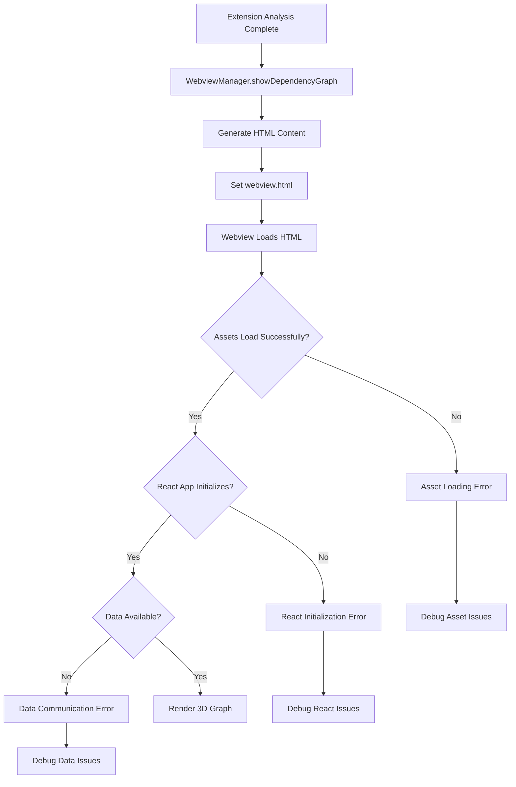

# Webview Rendering Fix - Design Document

## Overview

The webview rendering issue appears to be caused by a combination of factors including asset loading problems, Content Security Policy restrictions, data serialization issues, and potential React component initialization failures. This design outlines a systematic approach to diagnose and fix the blank webview problem.

## Architecture

### Problem Analysis Flow



### Root Cause Investigation Areas

1. **Asset Loading Issues**
   - Bundled assets not accessible
   - CDN fallback not working
   - CSP blocking external resources

2. **React Application Issues**
   - Component initialization failures
   - Error boundary catching silent errors
   - Missing DOM container

3. **Data Communication Issues**
   - Data not being passed to webview
   - JSON serialization problems
   - Data structure validation failures

4. **Content Security Policy Issues**
   - Scripts being blocked
   - External resources not whitelisted
   - Inline script restrictions

## Components and Interfaces

### Enhanced Error Logging System

```typescript
interface WebviewDebugInfo {
  assetsLoaded: boolean;
  reactInitialized: boolean;
  dataReceived: boolean;
  errors: WebviewError[];
  performanceMetrics: {
    loadTime: number;
    renderTime: number;
  };
}

interface WebviewError {
  type: 'asset' | 'react' | 'data' | 'csp';
  message: string;
  stack?: string;
  timestamp: number;
}
```

### Asset Loading Diagnostics

```typescript
interface AssetLoadingStatus {
  bundledAssetsAvailable: boolean;
  cdnFallbackWorking: boolean;
  specificAssetErrors: Record<string, string>;
  cspViolations: string[];
}
```

### Data Validation System

```typescript
interface DataValidationResult {
  isValid: boolean;
  errors: string[];
  nodeCount: number;
  linkCount: number;
  dataSize: number;
}
```

## Data Models

### Enhanced Webview HTML Template

The webview HTML will be enhanced with:

1. **Comprehensive Error Logging**
   - Console error capture
   - Asset loading monitoring
   - React error boundary reporting

2. **Progressive Loading Indicators**
   - Asset loading progress
   - React initialization status
   - Data processing status

3. **Fallback Mechanisms**
   - Simple HTML table for dependency data
   - Error recovery options
   - Manual reload capabilities

### Debug Information Collection

```typescript
interface WebviewDiagnostics {
  environment: {
    userAgent: string;
    vsCodeVersion: string;
    extensionVersion: string;
  };
  assets: AssetLoadingStatus;
  data: {
    received: boolean;
    valid: boolean;
    structure: any;
  };
  errors: WebviewError[];
}
```

## Error Handling

### Layered Error Detection

1. **Asset Loading Layer**
   - Monitor script load events
   - Detect CSP violations
   - Track CDN fallback attempts

2. **React Application Layer**
   - Enhanced error boundaries
   - Component lifecycle monitoring
   - State initialization tracking

3. **Data Processing Layer**
   - JSON parsing validation
   - Data structure verification
   - Empty data detection

4. **Rendering Layer**
   - 3D library initialization
   - Canvas creation monitoring
   - Render loop health checks

### Error Recovery Strategies

1. **Asset Loading Failures**
   - Automatic CDN fallback
   - Asset integrity verification
   - Manual asset reload options

2. **React Initialization Failures**
   - Component-level error boundaries
   - Graceful degradation to simple HTML
   - State reset capabilities

3. **Data Communication Failures**
   - Data re-request mechanisms
   - Alternative data formats
   - Manual data input options

## Testing Strategy

### Diagnostic Test Suite

1. **Asset Loading Tests**
   - Verify bundled assets accessibility
   - Test CDN fallback mechanisms
   - Validate CSP compliance

2. **React Component Tests**
   - Component initialization verification
   - Error boundary functionality
   - State management validation

3. **Data Communication Tests**
   - Data serialization/deserialization
   - Large dataset handling
   - Malformed data recovery

4. **Integration Tests**
   - End-to-end webview loading
   - Error scenario simulation
   - Performance benchmarking

### Debug Mode Implementation

A special debug mode will be implemented that:

1. **Enables Verbose Logging**
   - All asset loading attempts
   - React component lifecycle events
   - Data processing steps

2. **Provides Diagnostic UI**
   - Asset loading status indicators
   - Error message display
   - Manual recovery options

3. **Collects Performance Metrics**
   - Load time measurements
   - Render performance data
   - Memory usage tracking

### Implementation Phases

#### Phase 1: Enhanced Logging and Diagnostics

- Add comprehensive error logging to webview
- Implement asset loading monitoring
- Create diagnostic information collection

#### Phase 2: Error Recovery Mechanisms

- Implement automatic fallback strategies
- Add manual recovery options
- Create graceful degradation paths

#### Phase 3: Data Communication Validation

- Add data structure validation
- Implement data re-request mechanisms
- Create alternative data display formats

#### Phase 4: Performance and Reliability

- Optimize asset loading performance
- Implement health monitoring
- Add automated error recovery

This design provides a systematic approach to identifying and fixing the webview rendering issue while building robust error handling and recovery mechanisms for future reliability.
